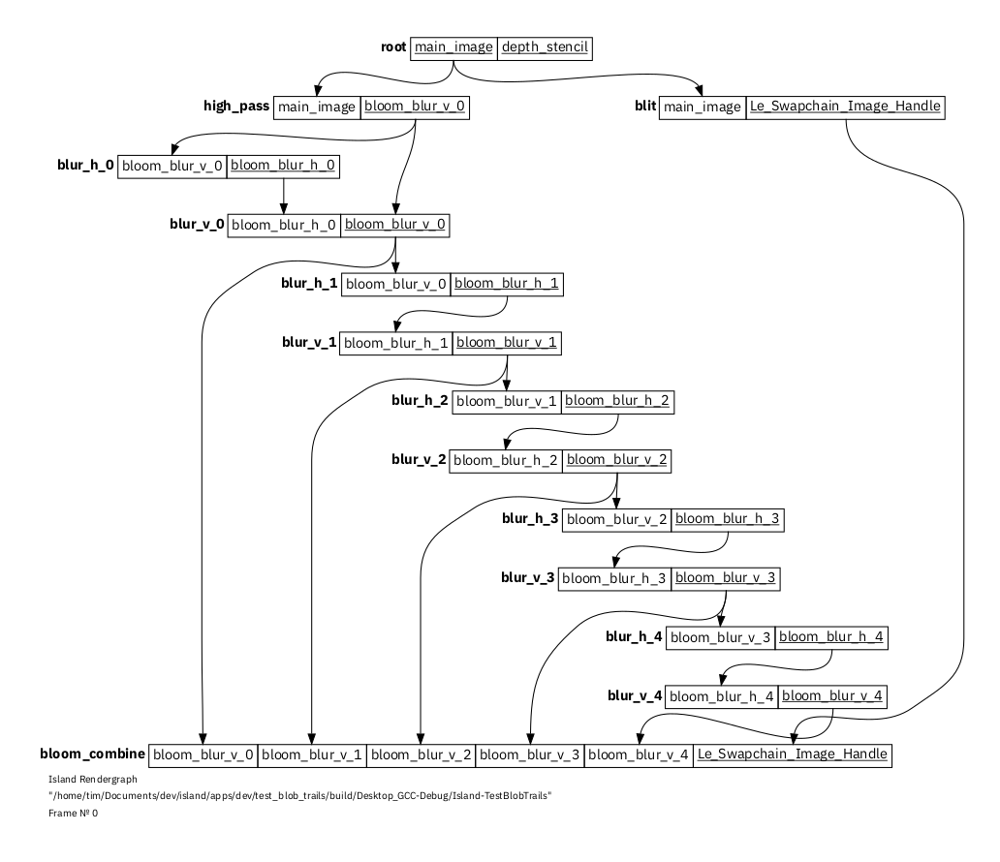
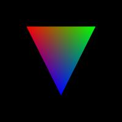

# Project Island 🌋🐎 [](https://travis-ci.com/tgfrerer/island)

Project Island is an experimental **Vulkan** renderer/proto-engine for Linux,
written in C/C++.

Island is written for **rapid protoyping and tweaking**. That's why it
allows **hot-reloading** wherever possible: for c/c++ application
code, GLSL shader code, even the renderer's own core modules. Each
module aims to be strictly isolated, which makes the codebase **fast
to compile**, especially in parallel.

**Note** The API is under active development, expect lots of change.
As such, there are no promises that it might be ready or fit for any
purpose, and the code here is released in the hope that you might find
it interesting. 

The initial motivation for writing Island was to experiment with
a modern rendering API (Vulkan), to learn by trying out ideas around
modern realtime-rendering, and to have a framework to create [visual
experiments](http://instagram.com/tgfrerer) with.


## Main Features:

* **Vulkan backend**: Island has a Vulkan rendering backend, which, on
  Linux, allows access to new and experimental GPU features soon after
  they are released. The renderer takes care of most of the
  bureaucracy which comes with modern APIs: Vulkan resources are
  automatically synchronised, and only allocated on demand. Most
  resource properties are *inferred* automatically based on the
  context of how the resource is being used. Pipelines are compiled
  and recompiled when needed. When compiled in Debug mode, Vulkan
  validation layers are loaded by default.

* **Hot-reloading**: An Island project is made from isolated c/cpp
  modules, each of which can be tweaked, re-compiled at runtime, and
  automatically hot-reloaded. The same applies to GLSL shader source
  files.

* **Fast compile times**:  Because of Island's modular architecture,
  recompilation & reload often takes less than 1 second, while the
  project keeps running. Typically, compilation from scratch for the
  whole codebase takes less than 6 seconds, and (re)compilation of an
  app module takes less than a second.

* **Static release binaries**: While Island is highly modular and
  dynamic when run in debug, it can compile into a single, optimised
  static binary for release. 

* **Rendergraph**: Rendering is structured using renderpasses.
  Renderpasses are executed on-demand and synchronised automatically
  by evaluating a rendergraph. If a renderpass is detected to have no
  effect on the final image, it is automatically pruned. For Debug
  targets, the rendergraph generates `.dot` files, which can be drawn
  using graphviz.  

  
  
* **GPU ray tracing** Island supports RTX via the *Khronos Vulkan
  raytracing extensions*. Creating acceleration structures and shader
  binding tables is automated and simplified as much as possible. Ray
  tracing shaders can be hot-reloaded.

* **GPU mesh shaders** gives you - optional - access to
  Nvidia-specific extensions for mesh and task shaders. These can be
  used in regular graphics pipelines.

* **Shader code debugging**: Shader GLSL code may be hot-reloaded too.
  Any change in shader files triggers a recompile, and (Vulkan)
  pipelines are automatically rebuilt if needed. Shaders may include
  other shaders via `#include` directives. Error messages will point
  at file and line number, and include a brief listing with
  problematic lines highlighted in context.

* **Code tweaks**: Near-instant in-code parameter tweaks for Debug
  builds (no need to recompile) by using a special `TWEAK()` macro.

* **Straight to video**: Island can render straight to screen using
  the direct rendering backend, or use any number of available options
  for a window-based vulkan swapchain. It's also easy to render
  straight to an mp4 file, or an image sequence without showing
  a window, by selecting the appropriate `le_swapchain`
  specialisation.

* **Helpers**: minimal effort to enable multisampling, import images,
  fonts

* **2d drawing context**: Draw thick lines and curves using
  `le_paths`, which specialises in 2d meshes. This module implements
  a useful subset of the SVG command palette, and includes some extras
  like for example a command to smoothen open or closed Bézier curves
  by applying the [Hobby algorithm][hobby]. Thick Bézier curves are
  drawn using [an algorithm outlined by T. F. Hain][hain].

* **glTF** Island wraps [cgltf][cgltf-link] for gltf file import, and
  the `le_stage` module can display and render most features found in
  gltf 2.0 files: pbrt materials, vertex animations, morph target
  animations, and skinning animations.

* **Job-system**: Cooperatively parallel workloads can be implemented
  using the `le_jobs` module, which implements a job system using
  coroutine-like fibers. Both backend and render modules are designed
  to minimise resource contention.

[hain]: https://doi.org/10.1016/j.cag.2005.08.002
[hobby]: http://weitz.de/hobby/
[cgltf-link]: https://github.com/jkuhlmann/cgltf

## Tools

+ [Project generator][app-generator]: Generates scaffolding for new
  apps, based on project templates
+ [Module generator][module-generator]: Generates scaffolding for new
  modules.

## Examples 

Island comes with a number of examples. No collection of examples
would be complete without a [hello
triangle](apps/examples/hello_triangle/) example, and a [hello
world](apps/examples/hello_world/) example.




A full list of examples can be found [here](apps/examples/). More examples to come.

## Modules

Island projects can be built by combining any number of island
modules. Each module aims to do **one thing well**, and to play nice
with others. Modules are automatically hot-reloaded, if a change is
detected and hot-reloading is active. Some modules provide their
functionality by wrapping well-known external libraries, some are
written entirely from scratch. Some of the most useful modules are
listed here:

| Module | Wraps | Description | 
| --- | :---: | --- | 
| `le_camera` | - | interactive, mouse controlled camera |
| `le_path` | - | draw svg-style paths, parse simplified SVG-style path command lists | 
| `le_tessellator` | [earcut][link-earcut], [libtess][link-libtess] | tessellation; dynamic choice of tessellation backend |
| `le_imgui` | [imgui][link-imgui] | graphical user interface |
| `le_pixels` | [stb image][link-stb_image] | load image files |
| `le_font` | [stb truetype][link-stb_truetype] | truetype glyph sdf, geometry and texture atlas based typesetting |
| `le_pipeline_builder` | - | build graphics, and compute pipelines | 
| `le_rtx_pipeline_builder` | - | build Khronos RTX raytracing pipelines | 
| `le_2d` | - | simplified 2d drawing context |
| `le_gltf` | [cgltf][link-cgltf] | load and parse glTF 2.0 files |
| `le_stage` | - | render 3d scenes, display animations | 
| `le_timebase` | - | timekeeping, canonical clock for animations | 
| `le_jobs` | - | fiber-based job system | 
| `le_ecs` | - | entity-component-system | 
| `le_shader_compiler` | [shaderc][link-shaderc] | compile glsl shaders to SPIR-V | 
| `le_window` | [glfw][glfw] | window i/o system | 
| `le_swapchain` | - | windowed, direct, or straight-to-video output | 
| `le_renderer` | - | record command buffers, evaluate rendergraphs |
| `le_backend` | - | interact with GPU via Vulkan, manage GPU resources |

To add a module, specify it in the application's `CMakeLists.txt` file. Modules
may depend on other modules, and the build system will automatically include
these dependencies. You can write your own modules - and there is a [module
template generator][module-generator] which provides you with a scaffold to
start from.

[link-imgui]: https://github.com/ocornut/imgui
[link-earcut]: https://github.com/mapbox/earcut.hpp
[link-libtess]: https://github.com/memononen/libtess2
[link-stb_image]: https://github.com/nothings/stb/blob/master/stb_image.h
[link-stb_truetype]: https://github.com/nothings/stb/blob/master/stb_truetype.h
[link-cgltf]: https://github.com/nothings/stb/blob/master/stb_truetype.h
[module-generator]: scripts/create_module.py
[app-generator]: scripts/create_app.py
[link-shaderc]: https://github.com/google/shaderc/

# Installation instructions

Island should run out of the box on a modern Linux system with
the current Vulkan SDK installed.

## Depencencies

Island depends on a few common development tools: CMake, gcc, git,
ninja. These are commonly found on a development machine. Island also
depends on [GLFW][glfw] (which can be installed via the package
manager `apt-get install libglfw3-dev` or similar on current Linux
distributions), and the Vulkan SDK.

[glfw]: https://github.com/glfw/glfw

## Install Vulkan SDK 

### Vulkan SDK >= `1.1.92.0`

I recommend to install the Vulkan SDK via a package manager. Follow
the installation instructions via:
<https://vulkan.lunarg.com/sdk/home#linux>.

### Manual Vulkan SDK install and legacy Vulkan SDK installation

Older Vulkan SDKs did not come with a Ubuntu package, and required
some extra steps to set up. These steps are documented in a [separate
readme](legacy_sdk_installation_instructions.md). 

## Building an Island project

🚨 If you freshly cloned the Island repository, remember to update
submodules before proceeding.🚨

    git submodule init
    git submodule update --depth=1

Then move to the directory of the Island project which you want to
compile:

    cd apps/examples/hello_triangle/

Build using CMake:

    mkdir build
    cd build
    cmake -G Ninja ..
    ninja

Run your new Island Application: 

    ./Island-HelloTriangle

**Note**: The CMAKE parameter `PLUGINS_DYNAMIC` lets you choose whether to
compile Island as a static binary, or as a thin module with dynamic plugins.
Unless you change this parameter, Debug builds will be built thin/dynamic with
hot-reloading enabled, and Release builds will produce a single static binary
with hot-reloading disabled. 

## IDE support

I recommend using the freely available [QT Creator][qt_creator] IDE, it allows
you to directly open CMake project files, and integrates pretty seamlessly with
the Island workflow: running, hot-reloading, then setting a breakpoint, and
then stepping whilst inspecting state in the debugger just works. Alternative
IDEs are of course available, and as long as they support CMake project files,
should work. When running an Island app with the debugger in Qt Creator, it's
important to check that `Run in terminal` is **disabled** - this can be
specified in the Run Settings dialog.

[qt_creator]: https://download.qt.io/official_releases/qtcreator/ 

## Auto-recompilation on save using `entr`

If you prefer to work without an IDE, but wish a setup where apps get
recompiled as soon as a source file changes, the following Linux-based
setup is pretty nice: 

```bash
    cd apps/examples/hello_triangle
    mkdir build
    cd build
    cmake -G Ninja ..
    # and then 
    git ls-files ../.. | entr ninja &
```

`entr(1)` is a great utility, which runs a command on file change.
This causes ninja to run as soon as any of the files checked into the
github repo at `hello_triangle` change.


## Acknowledgements

I would like to thank the folks at [our machinery][our_machinery] for
their wonderful [blog posts][our_mach_blog] on engine architecture and hot
reloading, these were a big initial inspiration for this project. 

[our_machinery]: https://ourmachinery.com/ 
[our_mach_blog]: https://ourmachinery.com/post/little-machines-working-together-part-1/
